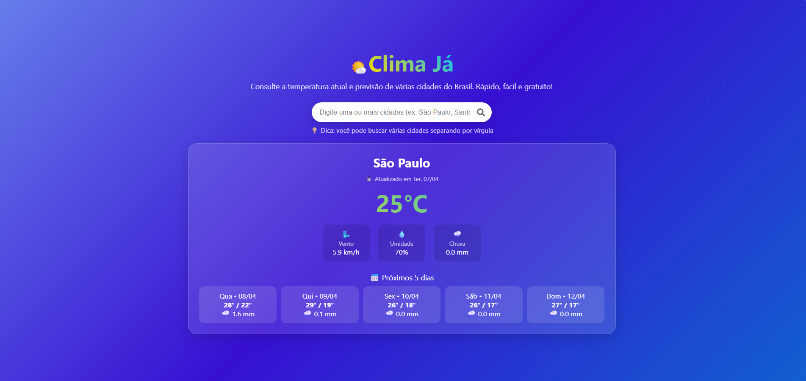
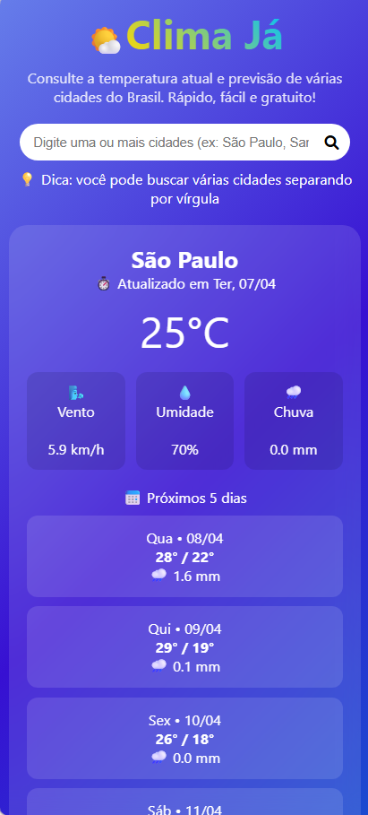

# 🌦️ Weather App - Open-Meteo API

> Um app simples e eficiente para consultar previsões do tempo em Python, com interface CLI e web.

## 📋 Visão Geral

Este aplicativo permite que usuários consultem a previsão do tempo e dados climáticos para qualquer cidade usando as APIs gratuitas do OpenMeteo. 

O projeto oferece **dois modos de uso**:
- **CLI** (Command Line Interface) - execução via terminal
- **Web** - interface Flask responsiva com suporte a múltiplas cidades

**Tecnologias principais**: Python 3.11+, Flask, requests

## ✨ Funcionalidades

- ✅ Busca de clima atual (temperatura, vento, umidade, precipitação)
- ✅ Previsão para 5 dias à frente
- ✅ Validação e geocodificação de cidades
- ✅ Cache inteligente para reduzir chamadas à API
- ✅ Rate limiting para evitar bloqueios
- ✅ Registro de consultas em `weather_log.txt`
- ✅ Tratamento robusto de erros
- ✅ Interface responsiva (mobile e desktop)
- ✅ Testes unitários automatizados (38 testes)

## 🚀 Quick Start

### Instalação Rápida

```bash
# Clone o repositório
cd weather-app

# Instale as dependências
pip install -r requirements.txt
```

### Modo CLI

```bash
cd app
python main.py
# Digite um nome de cidade quando solicitado
```

### Modo Web

```bash
cd app
python app.py
# Abra http://127.0.0.1:5000 no navegador
```

## 📸 Visualizações

### Desktop


### Mobile (Responsivo)


## 📖 Instalação Detalhada

### Pré-requisitos

- Python 3.11 ou superior

### Passos

1. **Clone ou baixe o repositório**:
   ```bash
   git clone  https://github.com/Jezebel1990/weather-app.git
   cd weather-app
   ```

2. **Crie um ambiente virtual** (recomendado):
   ```bash
   # Windows
   python -m venv venv
   venv\Scripts\activate

   # macOS/Linux
   python3 -m venv venv
   source venv/bin/activate
   ```

3. **Instale as dependências**:
   ```bash
   pip install -r requirements.txt
   ```

## 🎯 Como Usar

### Modo CLI (Linha de Comando)

1. Entre na pasta `app`:
   ```bash
   cd app
   ```

2. Execute o script:
   ```bash
   python main.py
   ```

3. Digite o nome de uma ou mais cidades (separadas por vírgula):
   ```
   Digite os nomes das cidades separados por vírgula: São Paulo, Santos, Rio de Janeiro
   ```

4. **Resultado esperado**:
   ```
   === São Paulo ===
   Temperatura: 25°C
   Vento: 10.5 km/h
   Umidade: 60%
   Precipitação: 0.0 mm (última hora)

   Previsão de 5 dias:
   Ter • 08/04 | Min: 18°C / Max: 28°C | Chuva: 0.0 mm | Vento: 15.0 km/h | Umidade: 65%
   ```

### Modo Web (Flask)

1. Entre na pasta `app`:
   ```bash
   cd app
   ```

2. Inicie o servidor:
   ```bash
   python app.py
   ```

3. Abra no navegador:
   ```
   http://127.0.0.1:5000/
   ```

4. Digite o nome da cidade no formulário e clique em buscar
5. Os resultados aparecem com clima atual e previsão de 5 dias

## 🧪 Testes Automatizados

O projeto inclui **38 testes unitários** que cobrem geocodificação, previsões e fluxo principal.

### Executar testes específicos

```bash
# Apenas testes do CLI principal
python -m unittest tests.test_main -v

# Apenas testes do módulo weather
python -m unittest tests.test_weather -v

# Apenas testes de geocodificação
python -m unittest tests.test_geocoding -v
```

### Executar todos os testes

```bash
python -m unittest tests.test_weather tests.test_geocoding tests.test_main -v
```

**Resultado esperado**: `Ran 38 tests in X.XXXs - OK`

## 📁 Estrutura do Projeto

```
weather-app/
├── README.md                 # Este arquivo
├── requirements.txt          # Dependências do projeto
│
├── app/                      # Código principal
│   ├── app.py               # Flask app (modo web)
│   ├── main.py              # CLI app (modo terminal)
│   ├── weather.py           # Funções de clima
│   ├── geocoding.py         # Funções de geocodificação
│   ├── weather_log.txt      # Log de consultas (auto-gerado)
│   ├── static/              # Arquivos CSS/JS
│   │   └── css/style.css    # Estilos
│   └── templates/           # Templates HTML
│       └── index.html       # Interface web
│
└── tests/                    # Testes unitários
    ├── __init__.py
    ├── test_main.py         # Testes do CLI
    ├── test_weather.py      # Testes de clima (18 testes)
    └── test_geocoding.py    # Testes de geocodificação (14 testes)
```

## 🔧 Módulos Principais

### `weather.py`
- `get_weather_data()` - Busca clima atual via API Open-Meteo
- `get_5_day_forecast()` - Busca previsão de 5 dias
- `get_cached_weather_data()` - Busca com cache inteligente
- Validação de coordenadas, rate limiting, tratamento de erros

### `geocoding.py`
- `get_coordinates()` - Converte nome de cidade em lat/lon
- `_is_valid_city_name()` - Valida input da cidade
- `_is_valid_coordinates()` - Valida coordenadas geográficas

### `main.py`
- CLI completa com suporte a múltiplas cidades
- Busca paralela de dados com `concurrent.futures`
- Registro em `weather_log.txt`

### `app.py` (Flask)
- Rota `/` para a interface web
- Rota `/weather` para processar requisições
- Template responsivo com HTML/CSS

## 🌱 Melhorias Futuras

- 🎨 Interface avançada com temas personalizáveis
- 📊 Gráficos de tendência de temperatura
- 🌍 Suporte a múltiplas cidades simultâneas na web
- 📡 Webhooks para alertas de condições extremas
- 💾 Cache persistente (banco de dados)
- 🌙 Modo dark/light automático
- 📱 App nativa móvel (React Native ou Flutter)
- 🗺️ Integração com mapas (Google Maps, Leaflet)

## 🤝 Contribuição

Contribuições são **muito bem-vindas**! 

### Como contribuir:

1. Faça um fork do repositório
2. Crie uma branch para sua feature (`git checkout -b feature/NovaFuncionalidade`)
3. Commit suas mudanças (`git commit -m 'Adiciona nova funcionalidade'`)
4. Push para a branch (`git push origin feature/NovaFuncionalidade`)
5. Abra um Pull Request

Por favor, certifique-se de:
- Adicionar testes para novas funcionalidades
- Seguir o estilo de código existente
- Atualizar a documentação conforme necessário

## 📄 Licença

Este projeto é de código aberto sob a licença **MIT**. Veja o arquivo `LICENSE` para mais detalhes.

---

**Desenvolvido com ❤️ usando Python, Flask e Open-Meteo API**

*Dúvidas? Abra uma issue no repositório!*
